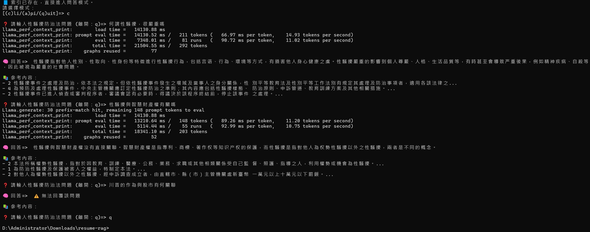
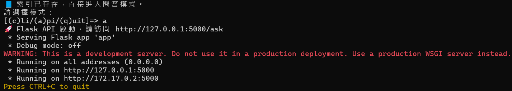
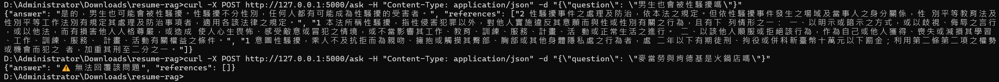
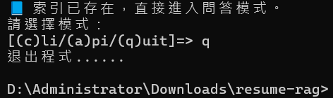

# 1. Introduction
- 本地LLM模型：使用 `llama_cpp_python` 載入 `mradermacher/chatglm3-6b-GGUF:Q4_K_M` 之GGUF模型
- 本地Embedding模型：使用 `SentenceTransformer` 載入 `bge-small-zh-v1.5` 模型

## 向量資料庫使用
- 向量庫：FAISS
- 向量維度：512 (由bge-small-zh-v1.5決定) \[[1](https://huggingface.co/BAAI/bge-small-zh-v1.5)\]
- 向量型態：float32
- 正規化：L2正規化 ( `normalize_embeddings=True` )；相似度：Cosine Similarity (流程：L2正規化 ⇒ IndexFlatIP內積 ⇒ 等價於Cosine Similarity)
- 索引類型：IndexFlatIP (精確內積索引，非近似搜尋；無額外參數，索引維度由向量維度自動決定)
- 檢索方式：為輕量化供CPU運行，取相似度最高的3個Chunk輸入至LLM

## 檔案清洗 & Chunk
- 檔案清洗：將連續空白與換行符號合併為單一空格，並將破折號 (－、—、-) 統一為「—」
- Chunk策略：
  - 每段長度：無限制
  - 重疊長度：無重疊
  - 策略：法規名稱與修正日期獨立為第一個Chunk；正文依「章 ⇒ 條 ⇒ 項」切分，最小以阿拉伯數字之「項」為單位，以提高檢索精準度；Chunk內容為條文本文，章節與條號另存於metadata ( `chunks_metadata.json` )

## 檢索 + 本地LLM回答
- 支援提問方式：CLI模式與API模式
- 回答顯示：
  - CLI模式：顯示「🧠 回答」與「📚 參考內容」(每筆參考內容顯示前80字)
  - API模式：回傳 `answer` 與 `references` 之JSON格式
- Token輸出限制：256
- 最高檢索相似度低於閾值 (0.6) 時，回覆：「⚠️ 無法回覆該問題」；空白問題則回覆：「⚠️ 無法回覆該問題 (空問題)」

## 模型與設計選擇原因
兼顧運行效率與準確率。

| 功能 | 模型/方法 | 選擇原因 |
| --- | --- | --- |
| Embedding | bge-small-zh-v1.5 | CPU可運行狀態下，選擇輕量化且也有不錯效能的模型 |
| 向量庫 | FAISS (IndexFlatIP) | CPU可用，簡單快速 |
| LLM | ChatGLM3-6B (Q4_K_M) | 中文表現好，Q4_K_M量化後可於CPU運行 |

## 參考資料
[1] https://huggingface.co/BAAI/bge-small-zh-v1.5

# 2. Download LLM Model (.gguf)
The LLM model (~3.9 GB) is not included in this repository. Download it from:

https://huggingface.co/mradermacher/chatglm3-6b-GGUF/resolve/main/chatglm3-6b.Q4_K_M.gguf

Rename it to `mradermacher_chatglm3-6b-GGUF_chatglm3-6b.Q4_K_M.gguf` and put it in the `./model` folder.

# 3. Python Installation
Create a virtual environment:

### Windows

```
python3.13 -m virtualenv rag
rag\Scripts\activate
```

### Linux

```
python3.13 -m venv rag
source rag/bin/activate
```

Install the required packages:

```
pip install -r requirements.txt
```

## Usage
```
python app.py
```

## API Usage (CMD for Windows/Terminal for Linux)
```
curl -X POST http://127.0.0.1:5000/ask -H "Content-Type: application/json" -d "{\"question\": \"<your_question_here>\"}"
```

### Example
```
curl -X POST http://127.0.0.1:5000/ask -H "Content-Type: application/json" -d "{\"question\": \"啥是性騷擾\"}"
```

{"answer": "性騷擾指性侵害犯罪以外，對他人實施違反其意願而與性或性別有關之行為，且有損害他人人格尊嚴，或造成使人心生畏怖、感受敵意或冒犯之情境，或不當影響其工作、教育、訓練、服務、計畫、活動或正常生活之進行。", "references": ["2 性騷擾事件之處理及防治，依本法之規定。但依性騷擾事件發生之場域及當事人之身分關係，性 別平等教育法及性別平等工作法別有規定其處理及防治事項者，適用各該法律之規定。", "1 本法所稱性騷擾，指性侵害犯罪以外，對他人實施違反其意願而與性或性別有關之行為，且有下 列情形之一： 一、以明示或暗示之方式，或以歧視、侮辱之言行，或以他法，而有損害他人人格尊嚴，或造成 使人心生畏怖、感受敵意或冒犯之情境，或不當影響其工作、教育、訓練、服務、計畫、活 動或正常生活之進行。 二、以該他人順服或拒絕該行為，作為自己或他人獲得、喪失或減損其學習、工作、訓練、服務、 計畫、活動有關權益之條件。", "法規名稱：性騷擾防治法 修正日期：民國 112 年 08 月 16 日"]}

```
curl -X POST http://127.0.0.1:5000/ask -H "Content-Type: application/json" -d "{\"question\": \"麥當勞還是肯德基好吃\"}"
```

{"answer": "⚠️ 無法回覆該問題", "references": []}

# 4. Docker Container Installation
Build Docker Image:

```
docker build -t rag:2026.09.25 .
```

Run Docker Container:

```
docker run -it --name=rag -p 5000:5000 rag:2026.09.25
```

Restart the exited Docker Container:

```
docker start -ai <container_id>
```

The usage for **Docker Container Installation** is as same as the **Python Installation**.

# 5. Demo
### CLI Mode



### API Mode





### Quit


